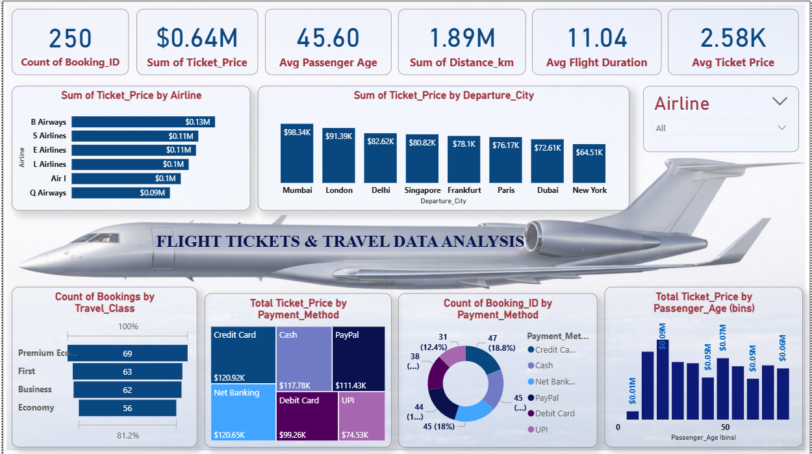

# ✈️ Flight Tickets & Travel Data Analysis (Power BI)

## 📌 Project Title

Flight Tickets & Travel Data Analysis Dashboard

## 📖 Headline

An interactive Power BI dashboard designed to analyze airline ticket pricing, passenger demographics, travel classes, and payment behavior to uncover meaningful business insights.

# 📊 About the Project

This project focuses on analyzing airline booking data using Power BI. The dashboard provides insights into ticket pricing, airline revenue, passenger demographics, travel classes, and payment methods.

The interactive visuals help identify patterns in flight bookings and highlight key factors influencing airline revenue and customer behavior.

# 🎯 Purpose of the Project

The main objectives of this project are:

* To analyze airline ticket sales and revenue patterns
* To understand passenger demographics and travel behavior
* To identify the most profitable airlines and routes
* To analyze customer payment preferences
* To provide meaningful insights using an interactive dashboard

# 🛠 Tech Stack

The dashboard was built using the following tools and technologies:

* **Power BI Desktop** – Data visualization and dashboard creation
* **Power Query** – Data cleaning and transformation
* **DAX (Data Analysis Expressions)** – Creating calculated metrics and KPIs
* **CSV Dataset** – Data source used for analysis

# 📂 Dataset

The dataset used for this project contains flight booking information including airlines, departure cities, passenger demographics, travel classes, ticket prices, flight duration, and payment methods.

The dataset file is included in this repository.

**Dataset File:**
`flight_booking_dataset.csv`

# 🧹 Data Cleaning & Transformation

Before building the dashboard, the dataset was processed using **Power Query** to ensure accurate analysis.

The following steps were performed:

* Checked and handled **missing values**
* Verified correct **data types for numerical and categorical fields**
* Cleaned and standardized **column names**
* Converted ticket price, distance, and duration columns into proper numeric format
* Removed inconsistent or duplicate records
* Prepared the dataset for creating **KPIs and visualizations**

# ❓ Key Questions Answered by the Dashboard

1. Which airlines generate the highest ticket revenue?
2. Which departure cities contribute the most to ticket sales?
3. How are bookings distributed across different travel classes?
4. Which payment methods are most commonly used by passengers?
5. What is the distribution of passengers across different age groups?
6. What are the overall key metrics such as total bookings, revenue, and average ticket price?

# ⭐ Features & Highlights

## 📈 Business Insights

* **B Airways** generates the highest ticket revenue among all airlines.
* **Mumbai and London** have the highest ticket sales among departure cities.
* **Premium Economy and First Class** show strong booking counts.
* **Credit Card and Net Banking** are the most commonly used payment methods.
* Passenger bookings are distributed across different age groups.

## 📊 Key Performance Indicators (KPIs)

* **Total Bookings:** 250
* **Total Ticket Revenue:** $0.64M
* **Average Passenger Age:** 45.60
* **Total Distance Travelled:** 1.89M km
* **Average Flight Duration:** 11.04 hours
* **Average Ticket Price:** 2.58K

# 📷 Dashboard Screenshot

# 📁 Project Files

* `FLIGHTANALYSIS.pbit` – Power BI template file
* `flight_booking_dataset.csv` – Dataset used for analysis
* `Dashboard.png` – Dashboard screenshot

# 👩‍💻 Author

Gayathri
Power BI | Data Analysis | Data Visualization
